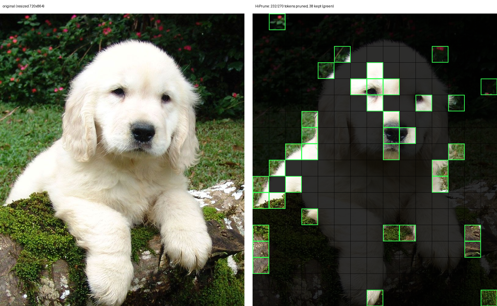

# HiPrune demo: visualize pruned patches from a served response

`visualize_pruned.py` renders the pruning data returned by a vLLM server
running Gemma 4 or Qwen2.5-VL with HiPrune (see the `token_pruning`
request field) as an overlay on the original image: pruned cells are
darkened and kept cells are outlined by HiPrune category — anchors
(red), buffers (orange), registers (green). Each cell covers `--cell`
pixels of the resized image: 48 for Gemma 4 (the default) and 28 for
Qwen2.5-VL.

Responses carry two pruning fields:

- `pruned_token_indices` — per image, the soft-token indices dropped.
- `token_pruning_metadata` — per image, the full statistics: grid
  dimensions, anchor/buffer/register/pruned index sets, and mean
  attention per category at the object and deep encoder layers.

## Usage

1. Serve the model:

   ```bash
   # Gemma 4
   VLLM_USE_V2_MODEL_RUNNER=0 vllm serve google/gemma-4-e4b-it --max-model-len 8192

   # Qwen2.5-VL (requires --enable-hiprune, which activates the
   # multimodal-pruning position handling and disables encoder CUDA graphs)
   vllm serve Qwen/Qwen2.5-VL-3B-Instruct --max-model-len 32768 --enable-hiprune
   ```

2. Send a request with `token_pruning` and save the JSON response:

   ```bash
   curl -s http://localhost:8000/v1/chat/completions \
     -H "Content-Type: application/json" \
     -d '{
       "model": "google/gemma-4-e4b-it",
       "messages": [{"role": "user", "content": [
         {"type": "image_url", "image_url": {"url": "data:image/jpeg;base64,'"$(base64 -w0 image.jpg)"'"}},
         {"type": "text", "text": "What breed of dog is this?"}
       ]}],
       "max_tokens": 60,
       "token_pruning": 0.14
     }' > response.json
   ```

3. Render the overlay:

   ```bash
   python3 visualize_pruned.py image.jpg response.json overlay.png   # Gemma 4
   python3 visualize_pruned.py image.jpg response.json overlay.png --cell 28  # Qwen2.5-VL
   ```

   Alongside `overlay.png` this also writes readable artifacts:

   - `overlay.metadata.json` — the pruning metadata, pretty-printed
   - `overlay.metadata.jsonl` — one compact line per image (batch-friendly)
   - `overlay.report.txt` — human-readable summary of the answer, token
     counts, category breakdown, and mean attention per category

   Optional flags enrich the report: pass `--baseline` with a response
   to the same request sent without `token_pruning` to show the
   baseline and pruned answers side by side, and `--request` with the
   request body JSON to prepend the prompt and request settings:

   ```bash
   python3 visualize_pruned.py image.jpg response.json overlay.png \
       --baseline baseline.json --request request.json
   ```

## Qwen2.5-VL notes

Unlike Gemma 4 (capped at 280 soft tokens per image), Qwen2.5-VL has no
token cap: a 4K image produces thousands of merged tokens, which is
where pruning actually pays off in prefill latency, not just prompt
length. The port follows the authors' released Qwen2.5-VL code exactly
for token selection: per-key attention captured dense and unmasked at
the object layer (16, the middle of the 32-block encoder) and the last
layer, averaged over heads and queries, folded 2x2 to merged tokens.
Kept tokens retain their original mRoPE grid positions (the same
position handling vLLM uses for EVS video pruning).

## Latency benchmark

`benchmark.py` sweeps `token_pruning` ratios over the same image and
prompt using streaming requests, measuring per ratio the prefill/TTFT
(includes the vision encoder), decode tok/s, and total time. It decodes
greedily (`temperature 0`) so answers are comparable across ratios, and
sets a random `cache_salt` per request so the prefix cache never hides
the prefill cost:

```bash
python3 benchmark.py image.jpg --prompt "Describe this image." \
    --url http://localhost:8000 --ratios 1.0 0.5 0.3 0.14 \
    --max-tokens 100 --out timing.json
```

Pass the resulting `timing.json` to `visualize_pruned.py --timing` to
append the latency table to the report.

## Accuracy benchmark (POPE)

`pope_eval.py` measures the accuracy/speed tradeoff on POPE (yes/no
object-hallucination questions on COCO images, from `lmms-lab/POPE` on
Hugging Face). It runs a balanced subset at several ratios with greedy
decoding, scores by yes/no matching, and logs per-request results
(JSONL) plus per-ratio aggregates. `plot_pope.py` turns the summary
into accuracy-vs-retention and accuracy-vs-TTFT charts.

```bash
pip install datasets pillow
python3 pope_eval.py --url http://localhost:8000 --num-samples 400 \
    --ratios 1.0 0.5 0.3 0.14 --concurrency 8 --out-dir ./pope_out
python3 plot_pope.py ./pope_out/pope_summary.json
```

Results from a 396-sample run on an A6000 (`google/gemma-4-e4b-it`):

| retention | accuracy | F1    | mean prompt tokens | mean TTFT |
|-----------|----------|-------|--------------------|-----------|
| baseline  | 0.866    | 0.860 | 286.9              | 0.113s    |
| 0.50      | 0.851    | 0.842 | 155.5              | 0.151s    |
| 0.30      | 0.846    | 0.837 | 103.1              | 0.141s    |
| 0.14      | 0.773    | 0.741 | 60.7               | 0.135s    |

Accuracy holds within ~2 points down to 0.3 retention, then drops
sharply at 0.14 (adversarial questions degrade first). Note the TTFT
column: on small, previously unseen images the pruned rows are *slower*
— the eager-attention capture pass in the vision encoder costs more
than the LLM-prefill saving when images are only ~280 soft tokens.
Pruning pays off in prompt length (KV-cache footprint, batching
capacity) at all ratios, and in TTFT only for repeated or token-heavy
inputs.

## Example output

`pruned_overlay.png` was produced from a real serving run at
`token_pruning: 0.14`: 232 of 270 soft tokens pruned, 38 kept (1 anchor,
4 buffers, 33 registers), and the model still answered "Golden
Retriever".


