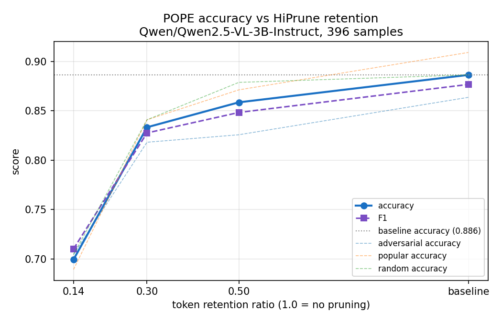
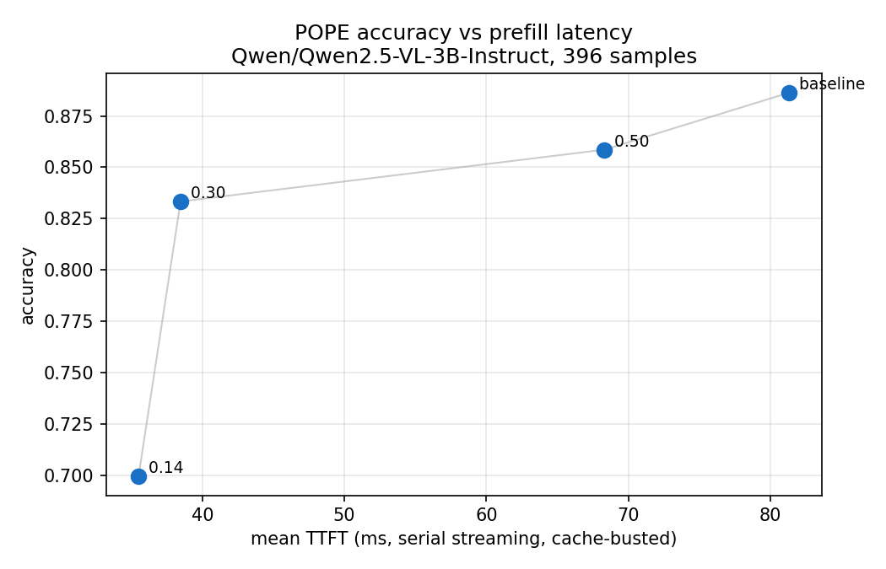
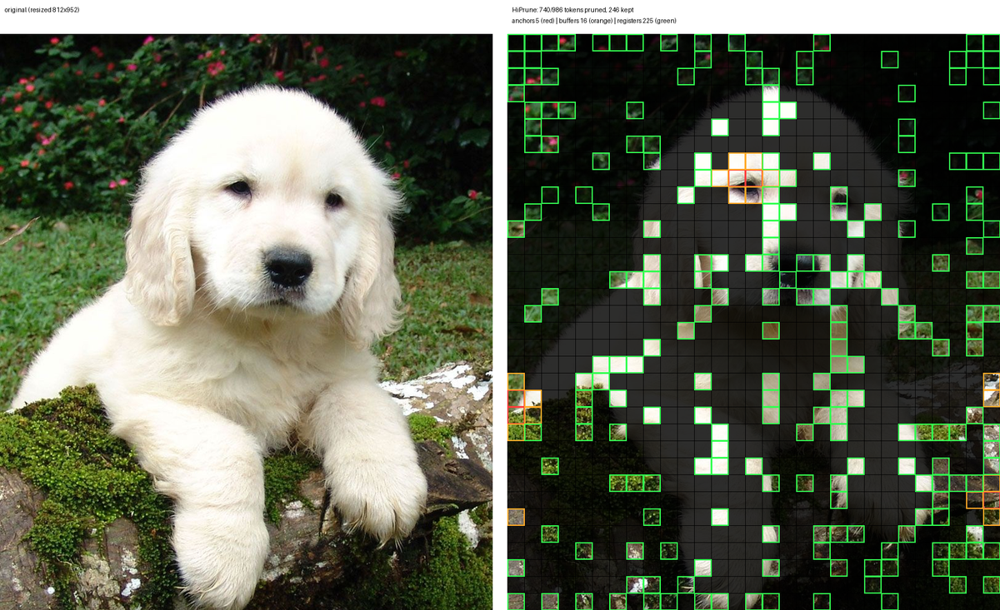

# HiPrune on Qwen2.5-VL-3B-Instruct — benchmark results

All numbers measured on an RTX A6000 (safeai-gpu3), serving
`Qwen/Qwen2.5-VL-3B-Instruct` with `vllm serve --enable-hiprune`,
streaming requests with prefix caching disabled via `cache_salt`
(cold-start prefill every time), `temperature: 0`.

## POPE accuracy vs speed

`pope_eval.py` on 396 balanced POPE samples (adversarial / popular /
random), 4 retention ratios. Raw log: `pope_summary.txt`.

| retention | accuracy | F1    | prompt tok | mean TTFT |
|-----------|----------|-------|------------|-----------|
| baseline  | 0.886    | 0.877 | 385.6      | 81 ms     |
| 0.50      | 0.859    | 0.848 | 209.9      | 68 ms     |
| 0.30      | 0.833    | 0.828 | 139.7      | 38 ms     |
| 0.14      | 0.699    | 0.710 | 83.4       | 36 ms     |

- At 50% retention: −2.7 points accuracy for ~1.8x fewer prompt tokens.
- At 30% retention: −5.3 points accuracy for ~2.8x fewer prompt tokens
  and a 2.1x faster TTFT.
- 0.14 is past the knee for a 3B model on this benchmark (57 of 1188
  answers were not parseable as yes/no).

## Latency vs image size

`benchmark.py` streaming latency on the pyramids photo at three input
resolutions ("Describe this image in detail.", 100 completion tokens).
Raw logs: `timing_qwen*.json`.

| image tokens (baseline) | retention | prompt tok | TTFT    |
|------------------------|-----------|------------|---------|
| 1,847                  | baseline  | 1,847      | 0.14 s  |
| 1,847                  | 0.30      | 573        | 0.34 s  |
| 4,083                  | baseline  | 4,083      | 0.30 s  |
| 4,083                  | 0.30      | 1,244      | 0.84 s  |
| 16,251                 | baseline  | 16,251     | 1.55 s  |
| 16,251                 | 0.30      | 4,894      | 6.69 s  |

Takeaway: single-request cold-start TTFT does **not** improve, because
HiPrune's exact attention-score capture is a dense O(S²) pass over the
vision tower (the ViT normally runs windowed attention). The wins are
elsewhere:

- **Prompt/KV budget**: 2–7x fewer image tokens in the LLM context and
  KV cache, which is what matters for long conversations, batched
  serving, and memory-bound decode.
- **Decode speed** improves slightly at every ratio (shorter context).
- With **encoder caching** (same image, multiple questions), capture is
  paid once and every subsequent request gets the full prompt-token
  saving for free.

## Answer fidelity spot check

`visualize_pruned.py` overlay for `token_pruning: 0.25` on the dog
photo (986 soft tokens -> 246 kept). Full report:
`dog_overlay_0.25.report.txt`.

- Baseline: "The puppy … appears to be a Golden Retriever. … it is not
  holding anything; it is simply sitting on a moss-covered log."
  (1,019 prompt tokens)
- Pruned 0.25: identical answer modulo one word ("demeanor" vs
  "nature"). (279 prompt tokens)

Left: original. Right: kept patches — anchors (red), buffers (orange),
registers (green); pruned patches dimmed.
