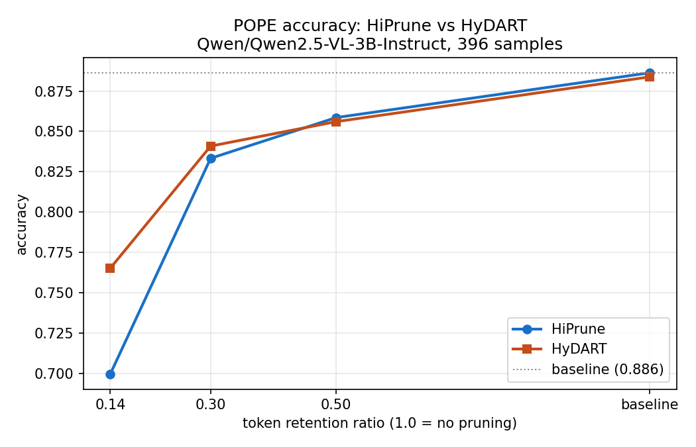
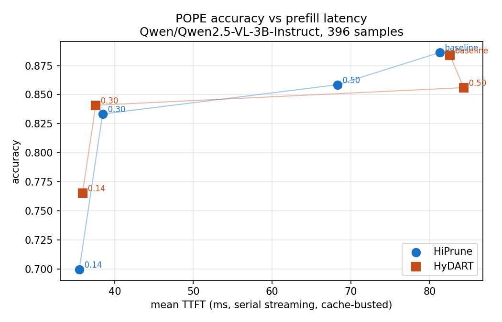
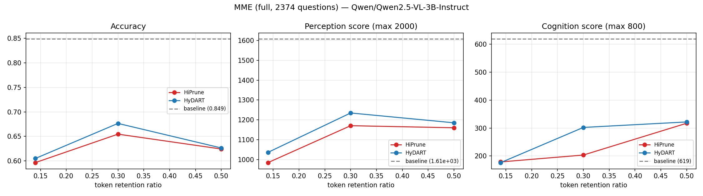
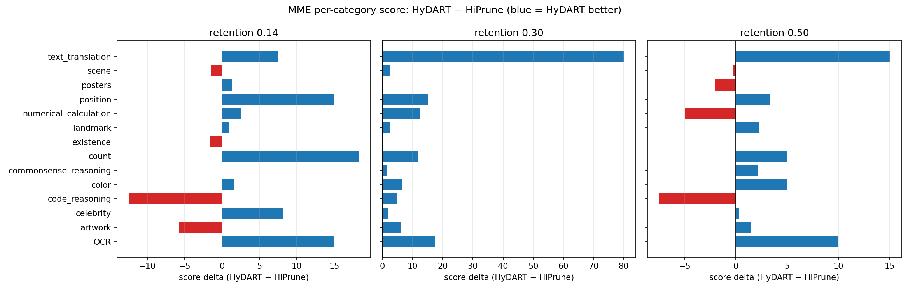
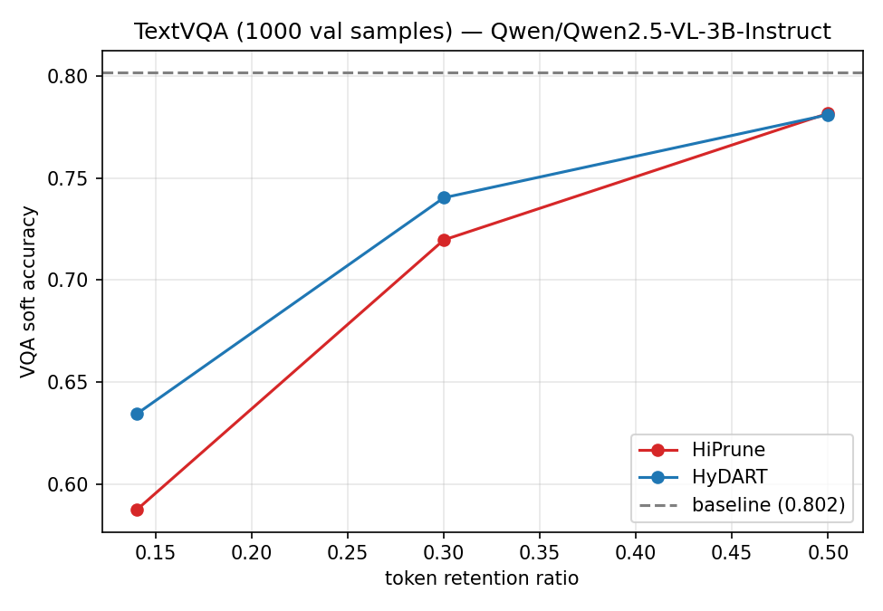
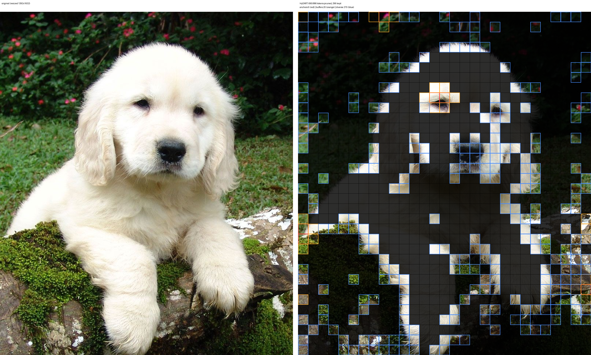

# HyDART on Qwen2.5-VL-3B-Instruct — benchmark results

HyDART keeps HiPrune's anchor+buffer stage (object-layer attention) and
replaces the deep-layer register stage with greedy MMR over the merged
visual embeddings (cosine-similarity duplication avoidance, DART-style).
Enabled with `HIPRUNE_METHOD=hydart`; defaults `HYDART_LAMBDA_SEED=0.1`,
`HYDART_LAMBDA_PICK=0.5`.

All numbers measured on an RTX A6000 (safeai-gpu3), serving
`Qwen/Qwen2.5-VL-3B-Instruct` with `vllm serve --enable-hiprune`,
streaming requests with prefix caching disabled via `cache_salt`
(cold-start prefill every time), `temperature: 0`. The HiPrune columns
are the same-protocol run from `../qwen2_5_vl/RESULTS.md`.

## POPE accuracy vs speed

`pope_eval.py` on the same 396 balanced POPE samples (adversarial /
popular / random) as the HiPrune run. Raw log: `pope_summary.txt`.

| retention | HiPrune acc | HyDART acc | HiPrune F1 | HyDART F1 | invalid (HiP → HyD) |
|-----------|-------------|------------|------------|-----------|---------------------|
| baseline  | 0.886       | 0.884      | 0.877      | 0.875     | 0 → 0               |
| 0.50      | 0.859       | 0.856      | 0.848      | 0.846     | 10 → 9              |
| 0.30      | 0.833       | **0.841**  | 0.828      | **0.839** | 17 → 16             |
| 0.14      | 0.699       | **0.765**  | 0.710      | **0.780** | 57 → 35             |

- Baseline rows differ by 1 answer (0.886 vs 0.884): the ratio-1.0 path
  is identical code; the difference is batching nondeterminism.
- At moderate pruning HyDART matches HiPrune (0.50) or edges past it
  (0.30, +0.8 points).
- At aggressive pruning (0.14) HyDART is **+6.6 points** accuracy and
  produces 35 unparseable answers instead of 57 (of 396): replacing
  low-attention deep-layer registers with embedding-diverse tokens
  preserves substantially more usable signal when the budget is tight.

## MME (full benchmark, 2,374 questions)

`mme_eval.py` on the full lmms-lab/MME test split (yes/no questions,
14 categories), official scoring: per category
`score = 100 * (acc + acc+)`, perception = 10 categories (max 2000),
cognition = 4 categories (max 800). Both methods answered the identical
question set; the baseline row is method-independent. Raw logs and JSON:
`mme_textvqa/mme_hydart/`, `mme_textvqa/mme_hiprune/`; paired stats:
`mme_textvqa/benchmark_summary.txt`.

| retention | HiPrune acc | HyDART acc | HiPrune perception | HyDART perception | HiPrune cognition | HyDART cognition | McNemar p |
|-----------|-------------|------------|--------------------|-------------------|-------------------|------------------|-----------|
| baseline  | —           | 0.849      | —                  | 1607.9            | —                 | 618.9            | —         |
| 0.50      | 0.624       | 0.626      | 1159.9             | 1185.0            | 317.1             | 321.8            | 0.85      |
| 0.30      | 0.655       | **0.676**  | 1170.4             | **1234.6**        | 203.2             | **302.1**        | **0.010** |
| 0.14      | 0.596       | 0.605      | 984.0              | 1035.7            | 178.6             | 176.1            | 0.39      |

- At 0.30 retention HyDART is +2.1 points accuracy, +64 perception and
  +99 cognition, and the paired McNemar test is significant (p ≈ 0.010;
  223 questions only HyDART got right vs 171 only HiPrune got right).
  At 0.50 and 0.14 the two methods are statistically indistinguishable.
- The per-category deltas (below) show HyDART's gains concentrate in
  OCR, count, position, and text_translation — categories where
  keeping *diverse* patches beats keeping low-attention registers.
- Caveat: MME under pruning produces many empty/unparseable replies
  (~20–25% at every pruned ratio, for both methods — mostly the
  knowledge-heavy celebrity/artwork/landmark/scene categories, scored
  as wrong here). Pruning hits MME much harder than POPE across the
  board; the comparison between methods is still apples-to-apples.

## TextVQA (1,000 validation samples)

`textvqa_eval.py` on a fixed-seed 1,000-question subset of the
lmms-lab/textvqa validation split, standard VQA soft accuracy
(`min(1, matches/3)` over 10 human answers). OCR-style questions are
the worst case for token pruning: small text lives in exactly the
patches pruning likes to drop. Raw logs: `mme_textvqa/textvqa_*`;
paired bootstrap CIs: `mme_textvqa/benchmark_summary.txt`.

| retention | HiPrune | HyDART | paired diff (95% CI) |
|-----------|---------|--------|----------------------|
| baseline  | —       | 0.802  | —                    |
| 0.50      | 0.782   | 0.781  | −0.001 [−0.014, +0.013] |
| 0.30      | 0.720   | **0.740** | +0.021 [−0.000, +0.042] |
| 0.14      | 0.587   | **0.634** | **+0.047 [+0.018, +0.075]** |

- Same shape as POPE: tied at 0.50, HyDART ahead at 0.30 (+2.1 points,
  CI touching zero), and clearly ahead at 0.14 (+4.7 points, bootstrap
  CI excludes zero).
- Both methods hold up surprisingly well on TextVQA at 0.50 (−2 points
  vs baseline) given the OCR sensitivity; the cliff is below 0.30.

## Lambda mini-grid

POPE at 0.30 / 0.14 retention per (λ_seed, λ_pick) config, same 396
samples. Raw logs: `pope_summary_ls*_lp*.txt`.

| λ_seed | λ_pick | acc @ 0.30 | acc @ 0.14 | note |
|--------|--------|------------|------------|------|
| 0.0    | 0.0    | 0.838      | 0.753      | attention-only fill (no diversity) |
| 0.0    | 0.5    | 0.838      | 0.760      | diversity among picks only |
| 0.1    | 0.5    | **0.841**  | **0.765**  | **default** |
| 0.1    | 1.0    | 0.841      | 0.753      | over-penalizing redundancy hurts at 0.14 |

The default (0.1, 0.5) is the best cell at both ratios. The spread is
small at 0.30 (0.3 points) and meaningful at 0.14 (1.2 points over
attention-only) — and even the worst HyDART cell beats HiPrune's 0.699
at 0.14 by 5+ points, so most of the gain comes from swapping registers
for embedding-based selection, with the MMR penalties adding a smaller
refinement on top.

## Latency vs image size

`benchmark.py` streaming latency on the pyramids photo at three input
resolutions ("Describe this image in detail.", 100 completion tokens).
Raw logs: `timing_hydart_pyramids*.json`. TTFT speedup is HiPrune TTFT
divided by HyDART TTFT at the same ratio (higher = HyDART faster).

| image tokens (baseline) | retention | HyDART TTFT | HiPrune TTFT | speedup |
|------------------------|-----------|-------------|--------------|---------|
| 1,847                  | 0.30      | 0.40 s      | 0.34 s       | 0.86x   |
| 4,083                  | 0.30      | 0.78 s      | 0.84 s       | 1.07x   |
| 16,251                 | 0.30      | 5.29 s      | 6.69 s       | 1.27x   |
| 16,251                 | 0.14      | 4.94 s      | 6.52 s       | 1.32x   |

HyDART needs only one dense O(S²) score capture (the object layer)
instead of two, so its selection overhead is roughly half of HiPrune's.
The saving grows with image size — 1.3x faster TTFT than HiPrune on the
16k-token image — but the remaining single capture still dominates
cold-start TTFT versus no pruning at all (see the HiPrune results for
why: the dense pass costs more than the LLM-prefill saving on one-shot
requests). On small images the MMR loop's sequential picks make HyDART
slightly slower than HiPrune; above ~2048 tokens the loop switches to
block picks of 8 which keeps it bounded. As with HiPrune, the wins are
prompt/KV budget at every ratio, and TTFT for repeated (encoder-cached)
or token-heavy inputs.

## Answer fidelity spot check

`visualize_pruned.py` overlay for `token_pruning: 0.3` on the dog photo
(986 soft tokens → 296 kept: 6 anchors, 20 buffers, 270 diverse). Full
report: `dog_overlay_0.3.report.txt`.

- Answer: "A fluffy white puppy is sitting on a moss-covered log,
  looking directly at the camera with its ears perked up."
  (322 vs 1,012 baseline prompt tokens)
- Metadata: diverse tokens averaged 0.746 cosine redundancy at
  selection; pruned tokens ended at 0.791 max similarity to the kept
  set — i.e. what was dropped is well covered by what was kept.

Left: original. Right: kept patches — anchors (red), buffers (orange),
diverse (blue); pruned patches dimmed.
